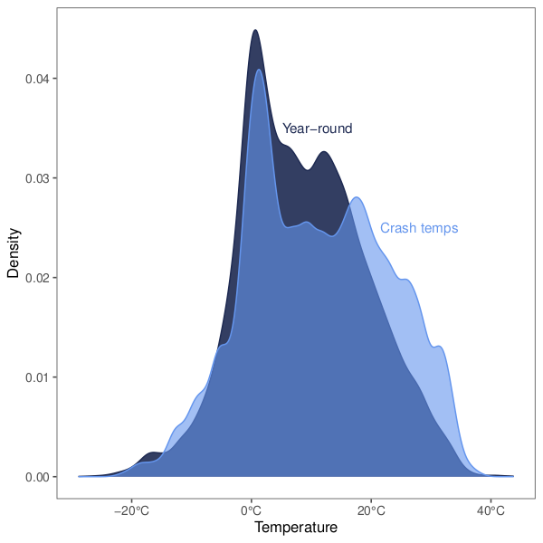
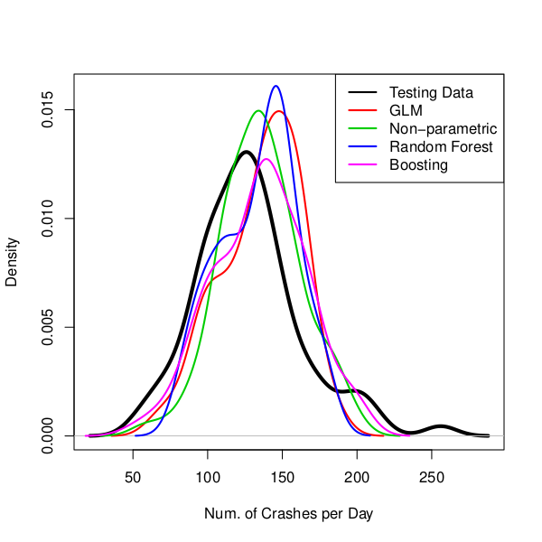
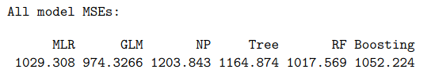
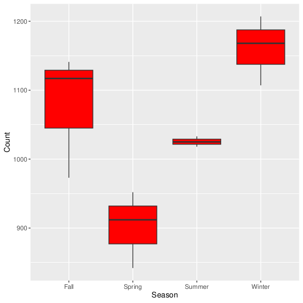
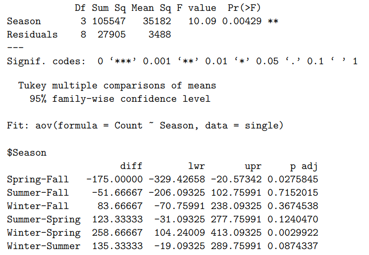

# Introduction

The purpose of this project is to investigate the relationship between local weather trends and vehicle accidents in the city of Kelowna.

The GitHub for this project can be found [here](https://github.com/jonahedmundson/kelowna_weathercrash).

**Table of Contents:**

* Data Source
* Data Description
* Data Cleaning
* Statistical Analysis
  * Variable Investigation
  * Regression
  * Neural Net (TBA)
* Conclusion

# Data Source

## Weather Data

Weather data was obtained from the [Government of Canada website](https://climate.weather.gc.ca/). The data used in this report was collected from [station \#48369](https://climate.weather.gc.ca/climate_data/daily_data_e.html?StationID=48369) (Kelowna NAVCAN weather station). Historical weather data can be downloaded in bulk from the Government of Canada meteorological database using the `wget` tool. The [command](https://drive.google.com/drive/folders/1WJCDEU34c60IfOnG4rv5EPZ4IhhW9vZH) for downloading the data used in this report is:

> ``for year in `seq 2017 2021`;do for month in `seq 1 12`;do wget --content-disposition "https://climate.weather.gc.ca/climate_data/bulk_data_e.html?format=csv&stationID=48369&Year=${year}&Month=${month}&Day=14&timeframe=1&submit= Download+Data" ;done;done``

## Crash Data

Crash data was obtained from the Insurance Corporation of British Columbia's ([ICBC](https://icbc.com/about-icbc/newsroom/Pages/Statistics.aspx)) public [Tableau profile](https://public.tableau.com/app/profile/icbc/viz/PublicDataset-ICBCReportedCrashesSouthernInterior/ICBCReportedCrashes-SouthernInterior). Extracted data included the municipalities of Kelowna and West Kelowna (formerly "Westbank").

# Data Description

## Weather data

Variable information/data dictionary is available on the Government of Canada [website](https://climate.weather.gc.ca/glossary_e.html). Block quotes in this section are from said website.

### Longitude (x)

Longitude coordinate of the weather station.

### Latitude (y)

Latitute coordinate of the weather station.

### Station Name

> The station name is the official name of any meteorological station in the National Climate Archive as administered by the Meteorological Service of Canada (MSC).

### Climate ID

An ID number associated with each meteorological station.

> The first digit assigned identifies the province where the second and third digits identify the climatological district within the province.

### Date/Time (LST)

Date and time that the weather conditions were recorded.

> The Local Standard Time (LST) is used for observation purposes and is that of the standard time zone in which the station is located, whether or not "daylight saving time" is adopted for other purposes. In Canada, Local Standard Time is commonly used for archiving surface weather observations.

The LST in Kelowna is Pacific Standard Time.

### Temp (°C)

The recorded air temperature in degrees Celcius.

### Dew Point Temp (°C)

> The dew point temperature in degrees Celsius (°C), a measure of the humidity of the air, is the temperature to which the air would have to be cooled to reach saturation with respect to liquid water. Saturation occurs when the air is holding the maximum water vapour possible at that temperature and atmospheric pressure.

### Rel Hum (%)

> Relative humidity in percent (%) is the ratio of the quantity of water vapour the air contains compared to the maximum amount it can hold at that particular temperature.

### Precip. Amount (mm)

> Any and all forms of water, liquid or solid, that falls from clouds and reaches the ground. This includes drizzle, freezing drizzle, freezing rain, hail, ice crystals, ice pellets, rain, snow, snow pellets, and snow grains. Types of precipitation that originate aloft are classified under Liquid Precipitation, Freezing Precipitation and Frozen Precipitation. The measurement of precipitation is expressed in terms of vertical depth of water (or water equivalent in the case of solid forms) which reaches the ground during a stated period. The millimetre (mm) is the unit of measurement of liquid precipitation and the vertical depth of water or water equivalent is express to the nearest 0.2 mm.

### Wind.Dir..10s.deg.

> The direction (true or geographic, not magnetic) from which the wind blows. It represents the average direction during the two minute period ending at the time of observation. Expressed in tens of degrees (10's deg), 9 means 90 degrees true or an east wind, and 36 means 360 degrees true or a wind blowing from the geographic North Pole. A value of zero (0) denotes a calm wind.

### Wind.Spd..km.h.

> The speed of motion of air in kilometres per hour (km/h) usually observed at 10 metres above the ground. It represents the average speed during the one-, two- or ten-minute period ending at the time of observation. In observing, it is measured in nautical miles per hour or kilometres per hour.

### Visibility..km.

> Visibility in kilometres (km) is the distance at which objects of suitable size can be seen and identified. Atmospheric visibility can be reduced by precipitation, fog, haze or other obstructions to visibility such as blowing snow or dust.

### Stn Press (kPa)

> The atmospheric pressure in kilopascals (kPa) at the station elevation. Atmospheric pressure is the force per unit area exerted by the atmosphere as a consequence of the mass of air in a vertical column from the elevation of the observing station to the top of the atmosphere.

### Wind.Chill

> Wind chill is an index to indicate how cold the weather feels to the average person. It is derived by combining temperature and wind velocity values into one number to reflect the perceived temperature.
For example, if the outside temperature is -10 °C and the wind chill is -20, it means that your face will feel more or less as cold as it would on a calm day when the temperature is -20 °C.

### Weather

> The state of the atmosphere at a specific time. It is the short term or instantaneous variations of the atmosphere, as opposed to the long term, or climatic changes.

## Crash data

Crash data from insurance companies is generally more comprehensive than police data.

From the [ICBC website](http://www.llbc.leg.bc.ca/public/pubdocs/bcdocs2019/690888/quick-statistics.pdf):

> ICBC crash data is generally much larger in volume than police crash data because:
- Basic insurance coverage through ICBC is mandatory; therefore crash occurrences are reported to ICBC.
- Whereas, police do not attend all crashes. Typically only the more serious crashes involving injury or fatality
are attended. In addition, the number of reports submitted by individuals to police is very low, as it’s not
mandatory that a crash be reported to police.

The definition for the `crash_severity` variable is cut-off, so here is the full definition:

> The level of crash severity:
- Casualty Crash: A crash resulting in an injury or fatality.
- Property Damage Only Crash: A crash resulting in material damages to property (vehicle or non-vehicle, such as structures) with no injuries or
fatalities.

# Data Cleaning

Relevant file: [Data Cleaning](./stats_scripts/datacleaning/datacleaning.pdf).

Two datasets were produced after cleaning:

* `alldata`: matches averaged weather data onto each individual crash
* `regdata`: matches combined crash data onto the weather data for each individual day (ie. reverse of `alldata`)

## Weather data

The weather data was quite clean already. I added some indicator variables for weather type, but didn't end up using them in the analysis.

## Crash Data

The crash data was also quite clean. The biggest takeaway here is that the Crash data is _anonymized_, meaning that I cannot directly link the exact weath conditions with each crash. Instead, weather data over 4-5 days is averaged (ex. all Mondays in October 2017), and then linked with all matching crashes.

# Statistical Analysis

## Variable Exploration

Relevant file: [Variable Exploration](./stats_scripts/variableinvestigation/variableinvestigation.pdf).

Variable exploration revealed that:

* weekdays have more collisions than weekends
* spring months have the least collisions
* dew point temperature and wind chill variables were removed due to high correlation with temperature
* 20% of all crashes had at least 1 casualty
* the most common crash types were 'Rear end' and 'Single vehicle'
* collisions with cyclists are almost always fatal (80%)
* Highway 97/Harvey Ave was consistently the most frequent location for collisions
* there was one outlier point with an abnormally high number of crashes & victims: a Thursday in November, 2017. I believe this point to be somehow in connection with the 2017 BC floods

*Figure 1: Year-round temperatures compared with crash temperatures.*

## Regression

Relevant file: [Regression](./stats_scripts/regression/regression.pdf).

### Predicting # of Crashes per Day

In order to test model accuracy, data from 2017-2020 was considered training data, and the 2021 data was used as testing data. Multiple regression techniques were applied, and model error (MSE) was used to compare models. The Generalized Linear Model (Gaussian family, identity link) approach had the lowest MSE, meaning that it had the highest prediction accuracy for the 2021 data. However, even this model was only able to account for ~45% of the variance in collision count. This indicates that there are other variables not included in this dataset that are helping to determine how many collisions will occur on any given day.

Statistically significant predictors in the GLM (for predicting the \# of crashes per day) included:

* Month
* Day of the week
* Relative humidity
* Wind direction
* Wind speed
* Visibility

*Figure 2: Comparison of the fit of several modelling approaches.*

*Figure 3: Comparison of MSEs from all regression approaches.*

### Predicting # of Victims per Day

The \# of victims per day is highly correlated with the \# of crashes per day, so the modelling for this response variable went quite similar as for the \# of crashes. Same as for the crashes, the GLM approach won out in predicting \# of victims. See the relevant file for more information.

### Answering Hypotheses

Insights from this section include:

* Visibility on a given day is inversely correlated with the \# of crashes per day.
* Temperature is (surprisingly) *not* a statistically significant predictor of the \# of crashes per day.
* It is unclear whether or not precipitation is a statistically significant predictor of the \# of crashes per day.
* Summer has more crashes involving cyclists and motorcyclists.
* The \# of crashes does not increase on the weekends (due to DUIs).
* Crash fatality (chance of a casualty crash) does not increase at nighttime.
* Winter has the most single vehicle collisions, but this (barely) isn't statistically different than summer months.

*Figure 4: The number of single vehicle collisons by season.*

*Figure 5: ANOVA and Tukey HSD results for testing if there is a difference in the number of single vehicle collisons by season. The Spring-Fall and Winter-Spring comparisons are statistically significant, but the Winter-Summer comparison is not.*

## Machine Learning Approach

Relevant file: [TBA](./NULL).

# Conclusion

In summary, I performed a unique, locally relevant statistical analysis by combining two open-source datasets. Weather variables were successfully used to predict the number of vehicle collisions per day in Kelowna, BC. These variables were also used to test several hypotheses concerning the effect of weather on vehicle collisions. However, weather conditions seem to account for only 45% of the variance in vehicle collisions, which indicates that more research in this area is needed.

# Other Relevant Studies

https://github.com/tobystaines/RoadAccidentsPODS/blob/master/Environmental%20Conditions%20and%20Road%20Traffic%20Collisions%20in%20the%20UK%20v1.2.pdf

https://www.sciencedirect.com/science/article/pii/S0001457518308455

https://ehjournal.biomedcentral.com/articles/10.1186/s12940-016-0189-x

https://www.sciencedirect.com/science/article/abs/pii/S0022437514000024

https://journals.sagepub.com/doi/abs/10.3141/1621-02

https://journals.sagepub.com/doi/abs/10.3141/2055-16

https://onlinelibrary.wiley.com/doi/abs/10.1002/ajim.22849

https://www.mdpi.com/2220-9964/4/4/2681

https://trid.trb.org/view/1396115
